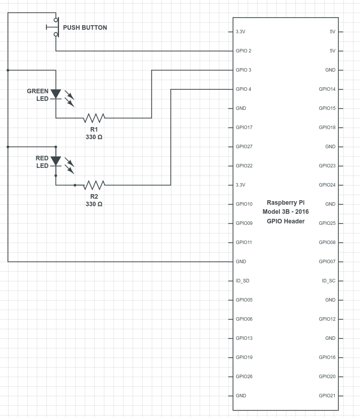

# Car-Detection by Raspberry Pi
A minute part of the prototype for smart car parking through raspberry pi this repository verifies the captured image consist of a car or not. If the image has a car it glows a green LED otherwise it turns on the red LED.


### Prerequisites

###### Hardware:

1. Raspberry Pi 3/2 not zero(no official TensorFlow installation is provided)
2. Raspberry Pi Camera Module
3. One Micro SD-Card
4. One Breadboard
5. One push button
6. One RED LED
7. One GREEN LED
8. Two 330Ω resistor's and some jumper cables


###### Softwares:
1. RASPBIAN STRETCH or RASPBIAN STRETCH LITE OS
2. Etcher
3. SD-Card Formatter


###### Libraries on Pi:
1. Python 2.7 (Defaultly installed on Pi OS )
2. PIP
3. RPi.GPIO
4. picamera
5. TensorFlow Module

### Installing

- First download raspbian stretch or raspbian stretch lite operating system image and burn to SD-Card using etcher tool and follow the below link to setup raspberry pi in a headless mode to perform SSH operations on it.

  i. Link to download raspbian OS download: [Raspberry Pi OS](https://www.raspberrypi.org/downloads/raspbian/)
 
  ii. Link to downalod etcher tool: [Etcher](https://etcher.io/)
 
  iii. Link to setup Pi Headless: [Headless setup](https://medium.com/a-path-to-pi/adding-ssh-and-wifi-to-a-headless-raspberry-pi-3-fresh-install-54be6634716e)
  
- Once you entered into pi terminal by following above link of Headless setup and then try to run following commands to install all the libraries required for this project.
  
    ```
    sudo apt-get install python-pip python-dev build-essential
    
    ```   
    ```
    sudo pip install --upgrade pip
    
    ```
    ```
    pip install RPi.GPIO
    
    ```  
    ```
    sudo apt-get install python-picamera python3-picamera
    
    ```
    
    Install TensorFlow from this [Link](https://www.tensorflow.org/install/install_raspbian)
    
- After Installing all the libraries connect picamera to raspberry pi and for remaining components follow the connections from below circuit diagram.



### Execution

- Once all the components are integrated with pi then make sure you have two images print out. One image with car or you can also show a toy car and another image with road or parking road. Now clone this repository to your pi then run following command for execution.

  ```
  python main.py
  ```

### Expected Output

- If you show the image with a car the GREEN LED will glow for 5 seconds Otherwise, If a image doesn't have a car then RED LED will glow for 5 seconds.

> When a vehicle is trying to enter into a car park this retrained tensorflow model will be helpful to detect it and future work of this project will be based on ANPR (Automatic Number Plate Recognition) of captured car images.

### Acknowledgments

- TensorFlow Inception model has been retrained by using two data sets
  1. [Cars Dataset](https://ai.stanford.edu/~jkrause/cars/car_dataset.html)
  2. [Vehicle Image Database](https://www.gti.ssr.upm.es/data/Vehicle_database.html) 

## Note:
  
- To convert your OS booted SD-Card to normal SD-Card. the SD Card Formatter software will be helpful download from this [link](https://www.sdcard.org/downloads/formatter_4/).
